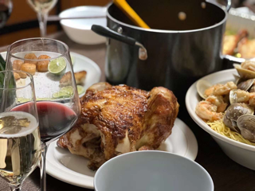
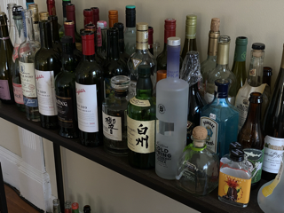
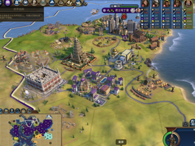
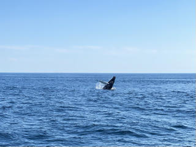
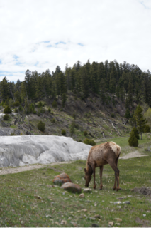
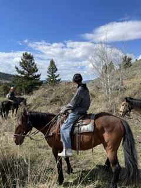
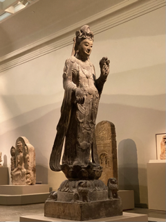
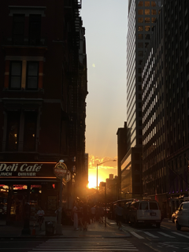
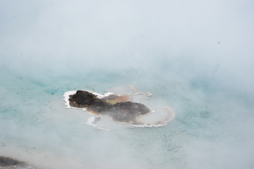

# Important : All of the following things will make way for research and work!!!!!

#### Art

Obtained my second major in Architecture and enjoy various ancient or modern architecture. 
Love art history, admire Kandinsky and Edgar the most, also visit contemporary art exhibition. If there is any opportunity to participate in a Generative Art project, I am very looking forward to it.

Was a drumer in a rock band. Pink Floyd and King Crimson are my favorite bands, also like a Chinese band, Omnipotent Youth Society, very much!

#### Daily Life

A Chinese and Western chef.

An amateur bartender and alcohol ‘expert’. 

Like Whisky & Gin

Like reading history, literature and philosophy, a follower of Kant.

And my mbti is ENTP.

#### Games

Enjoy playing various desktop games, from Texas poker to Splendor, and also Three Kingdoms Killing(San Guo Sha)

Big fans of Civilization 6, play LoL sometimes.

#### Travel and take some photos

